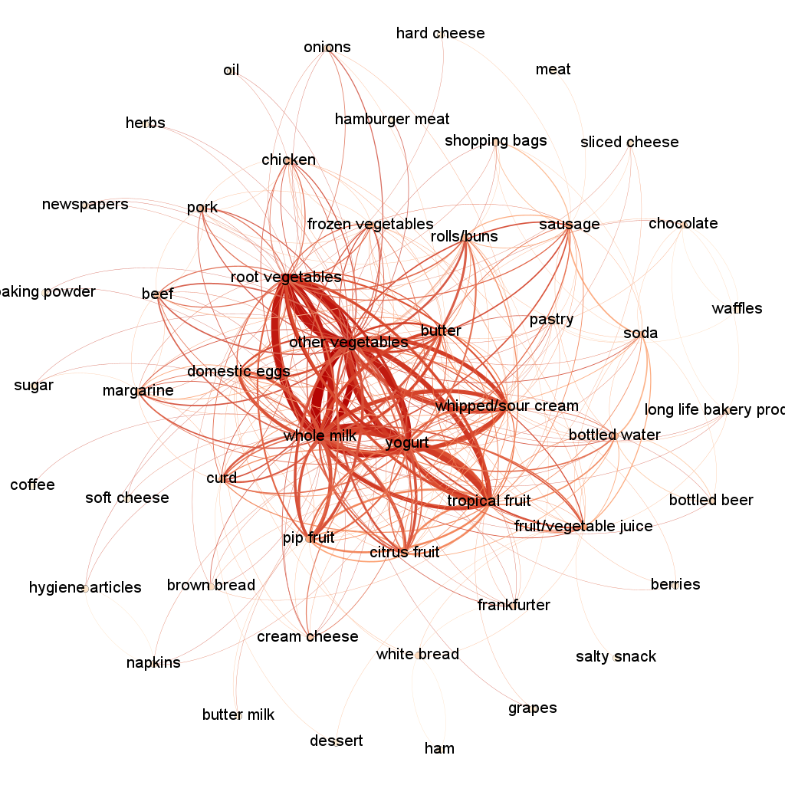

```{r echo=FALSE, results='hide', message=FALSE}
options(knitr.table.format = "latex")
```

# STA 280N Intro to Machine Learning Part 2 Take Home Exam


```{r setup, echo = FALSE}
knitr::opts_chunk$set(echo = TRUE)
knitr::opts_chunk$set(warning = FALSE, message = FALSE)
```


##### A link to a GitHub repo where the final report has been knitted and stored *in Markdown (.md) or PDF format*.

+--------------+---------------------------------------------------------------------------------------------------------------------------------------------+
| Type         | Link                                                                                                                                        |
+:=============+:============================================================================================================================================+
| RMD File     | ##### <https://github.com/AmritangshuM/STA380-am222239-Amrit/blob/main/Final_Assignment_Amritangshu_mlV5.Rmd>                               |
|              |                                                                                                                                             |
|              | #####                                                                                                                                       |
|              | <https://github.com/AmritangshuM/STA380-am222239-Amrit/blob/f2cd431d73536cf4fc606979a91c39ad18f26c2d/Final_Assignment_Amritangshu_mlV5.Rmd> |
+--------------+---------------------------------------------------------------------------------------------------------------------------------------------+

# \_\_\_\_\_\_\_\_\_\_\_\_\_\_\_\_\_\_\_\_\_\_\_\_\_\_\_\_\_\_\_\_\_\_\_\_\_\_\_\_\_\_\_\_\_\_\_\_\_\_\_\_\_\_\_\_


## Problem 1) Probability practice

__Part A.__ Visitors to your website are asked to answer a single survey question before they get access to the content on the page. Among all of the users, there are two categories: Random Clicker (RC), and Truthful Clicker (TC). There are two possible answers to the survey: yes and no. Random clickers would click either one with equal probability. You are also giving the information that the expected fraction of random clickers is 0.3.  After a trial period, you get the following survey results: 65\% said Yes and 35\% said No.   What fraction of people who are truthful clickers answered yes?  Hint: use the rule of total probability.

### Answer:

Let's assume the total no. of people who answered survey = 100 

$$S = 100$$

Now, we know expected fraction of Random Clickers (RC) = 0.3

$$P(RC) = 0.3$$

$$=> N(RC) = S*0.3 = 30$$
Now, Random Clickers are equally likely to answer Yes/No.

Therefore, of the 100 people who answered the survey, 30 were random clickers out of whom 15 answered **Yes** and 15 answered **No**

We know that at the end of the survey, we got 65% who voted Yes and 35% who voted No.


i.e


65 people voted **Yes** out of which 15 were Random Clickers
=> 50 who voted **Yes** were Truthful Clickers (TC)


35 people voted **No** out of which 15 were Random Clickers
=> 20 who voted **No** were Truthful Clickers (TC) 


Therefore,
Fraction of people who are Truthful Clickers (TC) who answered **Yes** 

= 50/(50+20)

= **5/7**


__Part B.__ Imagine a medical test for a disease with the following two attributes:  

- The sensitivity is about 0.993. That is, if someone has the disease, there is a probability of 0.993 that they will test positive.  
- The specificity is about 0.9999. This means that if someone doesn't have the disease, there is probability of 0.9999 that they will test negative.  
- In the general population, incidence of the disease is reasonably rare: about 0.0025% of all people have it (or 0.000025 as a decimal probability).

Suppose someone tests positive. What is the probability that they have the disease?  

### Answer:

Let's define the following events -

**P** =  Event that you test Positive

**N** = Event that you test Negative

**D** = Event that you have the Disease

**ND** = Event that you don't have the Disease

What is the probability that youi have the disease given you tested positive?

i.e

$$P(D \mid P) = ?$$

Now, we know the following - 

$P(P \mid D) = 0.9330$

$P(N \mid ND) = 0.9999$

$P(D) = 0.000025$

Now,

$P(ND) = 1-0.000025$

$\therefore P(ND) = 0.999975$


We know,
$$P(D \mid P) = \frac{P(D \cap P)}{P(P)}$$

Let's find the value of Numerator -

$P(P \mid D) = \frac {P(D \cap P)}{P(D)}$

$\therefore P(D \cap P) = P(P \mid D) \cdot P(D)$

$\therefore P(D \cap P) = 0.933*0.000025$

$\therefore P(D \cap P) = 0.000023325 ......(1)$

Now,

$P(P) = \sum_{X=0}^{N} P(X \cap P)$

$P(P) = P(D \cap P) + P(ND \cap P)$

$P(P) = 0.000023325 + P(ND \cap P)......(from 1)...(2)$


Now,

$P(P \mid ND) = 1 - P(N \mid ND)$

$\therefore P(P \mid ND) = 1 - 0.9999$

$\therefore P(P \mid ND) = 0.0001$

We know,

$P(P \mid ND) = \frac {P(ND \cap P)}{P(ND)}$

$\therefore P(ND \cap P) = P(P \mid ND) \cdot P(ND)$

$\therefore P(ND \cap P) = 0.0001*0.999975$

$\therefore P(ND \cap P) = 0.0000999975........(3)$


Now, from 2 and 3,

$P(P) = 0.000023325 + 0.0000999975$

$P(P) = 0.0001233225........(4)$


From 1 and 4, 

$P(D \mid P) = \frac{0.000023325}{0.0001233225}$

$\therefore P(D \mid P)=0.1891$

Hence, if you test positive, you have an 18.91% chance of having the disease.


## Problem 2: Wrangling the Billboard Top 100 


Consider the data in [billboard.csv](../data/billboard.csv) containing every song to appear on the weekly [Billboard Top 100](https://www.billboard.com/charts/hot-100/) chart since 1958, up through the middle of 2021.  Each row of this data corresponds to a single song in a single week.  For our purposes, the relevant columns here are:

- performer: who performed the song
- song: the title of the song
- year: year (1958 to 2021)
- week: chart week of that year (1, 2, etc)
- week_position: what position that song occupied that week on the Billboard top 100 chart.

 Use your skills in data wrangling and plotting to answer the following three questions.   

__Part A__:  Make a table of the top 10 most popular songs since 1958, as measured by the _total number of weeks that a song spent on the Billboard Top 100._  Note that these data end in week 22 of 2021, so the most popular songs of 2021 will not have up-to-the-minute data; please send our apologies to The Weeknd.   


### Solution:

Let's group by song and performer, summarize and sort in descending order by week count and print the top 10 entries -
```{r echo=FALSE, results='hide', message=FALSE, warning=FALSE}
library(dplyr)
library(tidyverse)
library(knitr)
library(ggplot2)
#install.packages("ggthemes") # Install 
library(ggthemes) # Load

#loading dataset -
bboard <- read.csv("data/billboard.csv")

bboard_top10 <- bboard %>% group_by(song, performer)

bboard_top10 <- bboard_top10 %>% 
  summarise(week_count = n())
  
bboard_top10 <- bboard_top10[order(-bboard_top10$week_count),]


```


```{r echo=FALSE}
knitr::kable(bboard_top10[1:10,], format="markdown", align = 'llcrr', caption = "Table 2.1 Top 10 Songs and their artists with maximum number of weeks in Billboard 100")
```


__Part B__: Is the "musical diversity" of the Billboard Top 100 changing over time?  Let's find out.  We'll measure the musical diversity of given year as _the number of unique songs that appeared in the Billboard Top 100 that year._  Make a line graph that plots this measure of musical diversity over the years.  The x axis should show the year, while the y axis should show the number of unique songs appearing at any position on the Billboard Top 100 chart in any week that year.  For this part, please filter the data set so that it excludes the years 1958 and 2021, since we do not have complete data on either of those years.   Give the figure an informative caption in which you explain what is shown in the figure and comment on any interesting trends you see.  

There are number of ways to accomplish the data wrangling here.  We offer you two hints on two possibilities:  

1) You could use two distinct sets of data-wrangling steps.  The first set of steps would get you a table that counts the number of times that a given song appears on the Top 100 in a given year.  The second set of steps operate on the result of the first set of steps; it would count the number of unique songs that appeared on the Top 100 in each year, _irrespective of how many times_ it had appeared.
2) You could use a single set of data-wrangling steps that combines the `length` and `unique` commands.  


### Solution:

```{r echo=FALSE}

year = seq(1959, 2020)

song_count = lapply(year, function(x) {length(unique(bboard[bboard$year==x,]$song_id))})
df = data.frame(year,unlist(song_count))
colnames(df) <- c('year','song_count')

p = ggplot(df, aes(x=year,y=song_count))+
  geom_line()+
  scale_x_continuous("Year", breaks = year[c(T,F)])+
  scale_y_continuous("Unique Song Count")+
  ggtitle("Song Diversity throughout the years")+
  theme_stata()+
  theme(axis.text.x = element_text(angle = 90, vjust = 0.5))
p
```

We can see that from the mid 1980s to the mid 2000s, we don't really have a lot of song diversity! The unique no. of songs that top the **Billboard 100** significantly drop in this era but we are seeing a rise in diversity from 2007 onwards.


__Part C__: Let's define a "ten-week hit" as a single song that appeared on the Billboard Top 100 for at least ten weeks.  There are 19 artists in U.S. musical history since 1958 who have had _at least 30 songs_ that were "ten-week hits."  Make a bar plot for these 19 artists, showing how many ten-week hits each one had in their musical career.   Give the plot an informative caption in which you explain what is shown.


### Solution:

```{r echo=F}
# Let's look at ten week hits

ten_week_hits = bboard_top10[bboard_top10$week_count>=10,]

ten_week_hits = ten_week_hits %>% 
  group_by(performer) %>%
  summarise(no_songs = n())

ten_week_hits <- ten_week_hits[ten_week_hits$no_songs>=30,]


plt = ggplot(ten_week_hits,aes(x=performer, y=no_songs))+
  geom_col()+
  theme_stata()+
  theme(axis.text.x = element_text(angle = 60, vjust = 0.5))+
  labs(x="Performer/Artist",y="Ten Week Hits", 
       caption="Shown here are list of artists who've had more than 30 \n Ten Week Hit songs in the Billboard 100 since 1958")+
  ggtitle("Artists with more than 30 Ten Week Hits")
  
plt
```


## Visual story telling part 1: green buildings

### The case  

Over the past decade, both investors and the general public have paid increasingly close attention to the benefits of environmentally conscious buildings. There are both ethical and economic forces at work here.  In commercial real estate, issues of eco-friendliness are intimately tied up with ordinary decisions about how to allocate capital. In this context, the decision to invest in eco-friendly buildings could pay off in at least four ways.  

1. Every building has the obvious list of recurring costs: water, climate control, lighting, waste disposal, and so forth. Almost by definition, these costs are lower in green buildings.  
2. Green buildings are often associated with better indoor environments—the kind that are full of sunlight, natural materials, and various other humane touches. Such environments, in turn, might result in higher employee productivity and lower absenteeism, and might therefore be more coveted by potential tenants. The financial impact of this factor, however, is rather hard to quantify ex ante; you cannot simply ask an engineer in the same way that you could ask a question such as, “How much are these solar panels likely to save on the power bill?”  
3. Green buildings make for good PR. They send a signal about social responsibility and ecological awareness, and might therefore command a premium from potential tenants who want their customers to associate them with these values. It is widely believed that a good corporate image may enable a firm to charge premium prices, to hire better talent, and to attract socially conscious investors.  
4. Finally, sustainable buildings might have longer economically valuable lives. For one thing, they are expected to last longer, in a direct physical sense. (One of the core concepts of the green-building movement is “life-cycle analysis,” which accounts for the high front-end environmental impact of ac- quiring materials and constructing a new building in the first place.) Moreover, green buildings may also be less susceptible to market risk—in particular, the risk that energy prices will spike, driving away tenants into the arms of bolder, greener investors.  

Of course, much of this is mere conjecture. At the end of the day, tenants may or may not be willing to pay a premium for rental space in green buildings. We can only find out by carefully examining data on the commercial real-estate market.  

The file [greenbuildings.csv](../data/greenbuildings.csv) contains data on 7,894 commercial rental properties from across the United States. Of these, 685 properties have been awarded either LEED or EnergyStar certification as a green building. You can easily find out more about these rating systems on the web, e.g. at www.usgbc.org. The basic idea is that a commercial property can receive a green certification if its energy efficiency, carbon footprint, site selection, and building materials meet certain environmental benchmarks, as certified by outside engineers.

A group of real estate economists constructed the data in the following way.  Of the 1,360 green-certified buildings listed as of December 2007 on the LEED or EnergyStar websites, current information about building characteristics and monthly rents were available for 685 of them.  In order to provide a control population, each of these 685 buildings was matched to a cluster of nearby commercial buildings in the CoStar database.  Each small cluster contains one green-certified building, and all non-rated buildings within a quarter-mile radius of the certified building.  On average, each of the 685 clusters contains roughly 12 buildings, for a total of 7,894 data points.

The columns of the data set are coded as follows:

- CS.PropertyID:  the building's unique identifier in the CoStar database.  
- cluster:  an identifier for the building cluster, with each cluster containing one green-certified building and at least one other non-green-certified building within a quarter-mile radius of the cluster center.  
- size:  the total square footage of available rental space in the building.  
- empl.gr:  the year-on-year growth rate in employment in the building's geographic region.  
- Rent:  the rent charged to tenants in the building, in dollars per square foot per calendar year.  
- leasing.rate:  a measure of occupancy; the fraction of the building's available space currently under lease.  
- stories:  the height of the building in stories.  
- age:  the age of the building in years.  
- renovated:  whether the building has undergone substantial renovations during its lifetime.  
- class.a, class.b:  indicators for two classes of building quality (the third is Class C).  These are relative classifications within a specific market.  Class A buildings are generally the highest-quality properties in a given market.  Class B buildings are a notch down, but still of reasonable quality.  Class C buildings are the least desirable properties in a given market.  
- green.rating:  an indicator for whether the building is either LEED- or EnergyStar-certified.  
- LEED, Energystar:  indicators for the two specific kinds of green certifications.  
- net:  an indicator as to whether the rent is quoted on a "net contract" basis.  Tenants with net-rental contracts pay their own utility costs, which are otherwise included in the quoted rental price.  
- amenities:  an indicator of whether at least one of the following amenities is available on-site: bank, convenience store, dry cleaner, restaurant, retail shops, fitness center.  
- cd.total.07:  number of cooling degree days in the building's region in 2007.  A degree day is a measure of demand for energy; higher values mean greater demand.  Cooling degree days are measured relative to a baseline outdoor temperature, below which a building needs no cooling.  
- hd.total07:  number of heating degree days in the building's region in 2007.  Heating degree days are also measured relative to a baseline outdoor temperature, above which a building needs no heating.  
- total.dd.07:  the total number of degree days (either heating or cooling) in the building's region in 2007.  
- Precipitation:  annual precipitation in inches in the building's geographic region.
- Gas.Costs:  a measure of how much natural gas costs in the building's geographic region.  
- Electricity.Costs:  a measure of how much electricity costs in the building's geographic region.  
- cluster.rent:  a measure of average rent per square-foot per calendar year in the building's local market.  


### The goal

An Austin real-estate developer is interested in the possible economic impact of "going green" in her latest project: a new 15-story mixed-use building on East Cesar Chavez, just across I-35 from downtown.  Will investing in a green building be worth it, from an economic perspective?  The baseline construction costs are $100 million, with a 5% expected premium for green certification.

The developer has had someone on her staff, who's been described to her as a "total Excel guru from his undergrad statistics course," run some numbers on this data set and make a preliminary recommendation.  Here's how this person described his process.

>I began by cleaning the data a little bit.  In particular, I noticed that a handful of the buildings in the data set had very low occupancy rates (less than 10\% of available space occupied).  I decided to remove these buildings from consideration, on the theory that these buildings might have something weird going on with them, and could potentially distort the analysis.  Once I scrubbed these low-occupancy buildings from the data set, I looked at the green buildings and non-green buildings separately.  The median market rent in the non-green buildings was $25 per square foot per year, while the median market rent in the green buildings was $27.60 per square foot per year: about $2.60 more per square foot.  (I used the median rather than the mean, because there were still some outliers in the data, and the median is a lot more robust to outliers.)  Because our building would be 250,000 square feet, this would translate into an additional $250000 x 2.6 = $650000 of extra revenue per year if we build the green building.

>Our expected baseline construction costs are $100 million, with a 5% expected premium for green certification.  Thus we should expect to spend an extra $5 million on the green building.  Based on the extra revenue we would make, we would recuperate these costs in $5000000/650000 = 7.7 years.  Even if our occupancy rate were only 90%, we would still recuperate the costs in a little over 8 years.  Thus from year 9 onwards, we would be making an extra $650,000 per year in profit.  Since the building will be earning rents for 30 years or more, it seems like a good financial move to build the green building.


The developer listened to this recommendation, understood the analysis, and still felt unconvinced.  She has therefore asked you to revisit the report, so that she can get a second opinion.

Do you agree with the conclusions of her on-staff stats guru?  If so, point to evidence supporting his case.  If not, explain specifically where and why the analysis goes wrong, and how it can be improved.  Do you see the possibility of confounding variables for the relationship between rent and green status?  If so, provide evidence for confounding, and see if you can also make a picture that visually shows how we might "adjust" for such a confounder.    _Tell your story in pictures, with appropriate introductory and supporting text._  

Note: this is intended as an exercise in visual and numerical story-telling. Your approach should rely on pictures and/or tables, not a regression model.  Tell a story understandable to a non-technical audience.  Keep it concise.   


### Solution:

```{r Answer 3(a), echo = FALSE}
library(corrplot)
library(mosaic)
library(tidyverse)
library(gridExtra)
library(ggplot2)
library(dplyr)
library(tidyverse)
data_load <- read.csv('data/greenbuildings.csv')
library(DataExplorer)
print('Lets check if we have any missing values')
plot_intro(data_load)
numeric_columns<- dplyr::select_if(data_load, is.numeric)
print('Lets look at the distribution of the data')
plot_histogram(numeric_columns)
print('Lets look at the correltion between these variables')
plot_correlation(na.omit(data_load), maxcat = 5L)
print('Lets look at the pairwise correltion between these variables')
GGally::ggpairs(data_load, 
                columns = c('cluster_rent', "class_a", "Rent", 'Gas_Costs', 'green_rating'))
print('Lets look at the mean and median rent in the data')
hist(data_load$Rent)
abline(v = median(data_load$Rent), col = "blue", lwd = 3)
abline(v = mean(data_load$Rent), col = "red", lwd = 3)
print('Lets look at the distribution of these features across various metrics')
p5<-ggplot(data=data_load) + 
  geom_point(mapping=aes(x=cluster_rent, y=Rent))+
  labs(title="Measuring cluster rent vs rent")
p6<-ggplot(data=data_load) + 
  geom_point(mapping=aes(x=age, y=Rent))+
  labs(title="Measuring age vs rent")
p3<-ggplot(data=data_load) + 
  geom_point(mapping=aes(x=size, y=Rent))+
  labs(title="Measuring size vs rent")
p4<-ggplot(data=data_load) + 
  geom_point(mapping=aes(x=stories, y=Rent))+
  labs(title="Measuring stories vs rent")
grid.arrange(p5, p6,p3,p4, nrow = 2)
print('we observed that Rent is correlated with the cluster rent, size, class A. Additionally, Class a buildings get higher rent')
library(ggplot2)
print('Lets look at the impact of Class A buildings on rent of green rated houses')
p1<-ggplot(data_load,aes(x= Rent, fill=factor(green_rating)))+geom_histogram(bins = 50)+ 
  facet_wrap(~class_a)+
  labs(subtitle="Measuring rent with green rating")
p2<-ggplot(data_load,aes(x= cluster_rent, fill=factor(green_rating)))+geom_histogram(bins = 50)+ 
  facet_wrap(~class_a)+
  labs(subtitle="Measuring cluster rent with green rating")
grid.arrange(p1, p2, nrow = 2)
print('we can observe that the class A buildings have better rent if they are green rated here')
print('Lets look at the consumption of resources for green buildings')
p5<-ggplot(data_load,aes(x= size, fill=factor(green_rating)))+geom_histogram(bins = 50)+
  labs(subtitle="Measuring size of building with green rating")
p6<-ggplot(data_load,aes(x= stories, fill=factor(green_rating)))+geom_histogram(bins = 50)+
  labs(subtitle="Measuring number of stories with green rating")
p3<-ggplot(data_load,aes(x= Gas_Costs, fill=factor(green_rating)))+geom_histogram(bins = 50)+
  labs(subtitle="Measuring gas cost with green rating")
p4<-ggplot(data_load,aes(x= Electricity_Costs, fill=factor(green_rating)))+geom_histogram(bins = 50)+
  labs(subtitle="Measuring Electricity use of building with green rating")
grid.arrange(p5, p6,p3,p4, nrow = 4)
print('Lets look at the density of green rated houses with various metrics')
ggplot(data_load, aes(class_a, ..count..)) + geom_bar(aes(fill = green_rating))
g = ggplot(data_load, aes(x=age))
g + geom_density(aes(fill=factor(green_rating)))+
  labs(title="Measuring age with green rating vs without")
g = ggplot(data_load, aes(x=size))
g + geom_density(aes(fill=factor(green_rating)))+
  labs(title="Measuring size with green rating vs without")
g = ggplot(data_load, aes(x=cluster_rent))
g + geom_density(aes(fill=factor(green_rating)))+
  labs(title="Measuring cluster_rent with green rating vs without")
g = ggplot(data_load, aes(x=Rent))
g + geom_density(aes(fill=factor(green_rating)))+
  labs(title="Measuring rent with green rating vs without")
```

We observed most of the green buildings are younger than non-green buildings and the proportion of class a buildings is higher in green buildings

Since Stats Guru fails to account for all factors that affect rent, his analysis is wrong In order to calculate the returns, he began by using the median rent for all buildings.Because of this, he fails to factor in other factors, such as the size and class of the buildings,into his analysis. For instance, we have a class A building will yield a higher rent than a non-green building.


## Visual story telling part 2: Capital Metro data

The file [capmetro_UT.csv](../data/capmetro_UT.csv) contains data from Austin's own Capital Metro bus network, including shuttles to, from, and around the UT campus. These data track ridership on buses in the UT area. Ridership is measured by an optical scanner that counts how many people embark and alight the bus at each stop. Each row in the data set corresponds to a 15-minute period between the hours of 6 AM and 10 PM, each and every day, from September through November 2018. The variables are:  

- _timestamp_: the beginning of the 15-minute window for that row of data
- _boarding_: how many people got on board any Capital Metro bus on the UT campus in the specific 15 minute window
- _alighting_: how many people got off ("alit") any Capital Metro bus on the UT campus in the specific 15 minute window
- _day_of_week_ and _weekend_: Monday, Tuesday, etc, as well as an indicator for whether it's a weekend.
- _temperature_: temperature at that time in degrees F
- _hour_of_day_: on 24-hour time, so 6 for 6 AM, 13 for 1 PM, 14 for 2 PM, etc.
- _month_: July through December

Your task is to create a figure, or set of related figures, that tell an interesting story about Capital Metro ridership patterns around the UT-Austin campus during the semester in question.  Provide a clear annotation/caption for each figure, but the figure(s) should be more or less stand-alone, in that you shouldn't need many, many paragraphs to convey its meaning.  Rather, the figure together with a concise caption should speak for itself as far as possible. 

You have broad freedom to look at any variables you'd like here -- try to find that sweet spot where you're showing genuinely interesting relationships among more than just two variables, but where the resulting figure or set of figures doesn't become overwhelming/confusing.  (Faceting/panel plots might be especially useful here.)  


### Solution:


To figure out interesting Capital Metro ridership patterns around the UT-Austin we started with loading the data and then looking at various aspects of the same. We focused on weekly, monthly ridership and also the riding trends during the day.

```{r Answer 4(a), echo = FALSE}
library(gridExtra)
library(ggplot2)
library(dplyr)
library(tidyverse)
capmetro <- read.csv("data/capmetro_UT.csv")
library(DataExplorer)
print('Lets check if we have any missing values')
plot_intro(capmetro)
numeric_columns<- dplyr::select_if(capmetro, is.numeric)
print('We can now plot the distribution of this data')
plot_histogram(numeric_columns)
print('lets look at the hourly trend of ridership')
daily_rides = capmetro %>%group_by(hour_of_day) %>%summarize(riders = mean(boarding))
daily_rides_2 = capmetro %>%group_by(hour_of_day) %>%summarize(riders = mean(alighting))
p1=ggplot(daily_rides) + geom_line(aes(x=hour_of_day, y=riders))+ ggtitle("Number of people boarding")
p2=ggplot(daily_rides_2) + geom_line(aes(x=hour_of_day, y=riders))+ ggtitle("Number of people alighting")
grid.arrange(p1, p2, nrow = 1)
print('Lets look at the weekly trend of ridership')
daily_rides_3 = capmetro %>%group_by(hour_of_day,day_of_week) %>%summarize(riders = mean(boarding))
ggplot(daily_rides_3) + 
  geom_point(aes(x=hour_of_day, y=riders)) + 
  facet_wrap(~day_of_week) +
  labs(x="hour of the day",
       y="Number of riders",
       title="Number of riders by day across days of week")
print('lets look at the monthly trend of ridership')
daily_rides_4 = capmetro %>%group_by(day_of_week,month) %>%summarize(riders = mean(boarding))
ggplot(daily_rides_4) + 
  geom_point(aes(x=day_of_week, y=riders)) + 
  facet_wrap(~month) +
  labs(x="Day of the Week",
       y="Number of riders",
       title="Number of riders by day across months")
daily_rides_5 = capmetro %>%group_by(day_of_week,hour_of_day) %>%summarize(temperature = mean(temperature))
ggplot(daily_rides_5) + 
  geom_line(aes(x=hour_of_day, y=temperature))+ ggtitle("Temperature trends throughout the week") +
  facet_wrap(~day_of_week)
daily_rides_6 = capmetro %>%group_by(day_of_week,hour_of_day,month) %>%summarize(temperature = mean(temperature))
ggplot(daily_rides_6) + 
  geom_line(aes(x=day_of_week, y=temperature))+ ggtitle("Temperature range across months") +
  facet_wrap(~month)
```

We looked at the daily, weekly and monthly distributions of the data and saw interesting trends like more people leave the bus during the early part of the day and interestingly the temperature of day can also be measure from this data. We also looked at monthly trends in ridership across the months of Oct, Sep and Nov. We also looked at temperature trends and ridership throughout the week.


Let's also look at hour-wise traffic distribution for months from July to December -

```{r echo=FALSE, message=FALSE, warning=FALSE, fig.show='hold', out.width="50%"}

df = read.csv("data/capmetro_UT.csv")
summary(df)
#Let's summarize by hour for different months -
hour_board <- df %>%
  group_by(month,hour_of_day) %>%
  summarize(avg_board = mean(boarding))

plt_1 = ggplot(hour_board, aes(x=hour_of_day, y=avg_board,color=month))+
  geom_line()+
  theme_stata()+
  ggtitle("Average no. of people boarding bus per hour")+
  xlab("Hour of Day")+
  ylab("No. of people on-boarding")

#Let's summarize by hour for different months -
hour_alit <- df %>%
  group_by(month,hour_of_day) %>%
  summarize(avg_alit = mean(alighting))


plt_2 = ggplot(hour_alit, aes(x=hour_of_day, y=avg_alit,color=month))+
  geom_line()+
  theme_stata()+
  ggtitle("Average no. of people off-boarding bus per hour")+
  xlab("Hour of Day")+
  ylab("No. of people off-boarding")

par(mfrow=c(1,2))
plt_1
plt_2
```


There are some weird discrepancies if you look at it without thinking much.


We can make the following observations -

* The distribution for no. of people on-boarding and off-boarding doesn't change much in any month


* Average ridership is the least in the month of November (maybe because it's too cold and students don't want to take public transport) and most in the month of October


* The no. of people on-boarding the bus peaks around 4-6pm in the evening which is when most classes get over and students are heading home.

* No. of people off-boarding the bus is highest in the morning hours, possibly when most students get off at campus for their morning lectures.

* The graphs are not in sync (spikes in on-boarding don't coincide with spikes in off-boarding). This may be the case because students all get off at the same location in campus together but they board the bus over a span of couple of hours (so average boarding per hour is low but off-boarding per hour is high) with the same logic being applied to spikes in on-boarding count.


This distribution seems to be heavily influenced by students going to and fro from campus for college. Let's try to look at the distribution on the weekends -

```{r echo=F, message=F, warning=F, fig.show='hold', out.width="50%"}
hour_board_day <- df[df$weekend=="weekend",] %>%
  group_by(month,hour_of_day) %>%
  summarize(avg_board = mean(boarding))

plt_3 = ggplot(hour_board_day, aes(x=hour_of_day, y=avg_board,color=month))+
  geom_line()+
  theme_stata()+
  ggtitle("Average no. of people boarding bus per hour")+
  xlab("Hour of Day")+
  ylab("No. of people on-boarding")

#Let's summarize by hour for different months -
hour_alit_day <- df[df$weekend=="weekend",] %>%
  group_by(month,hour_of_day) %>%
  summarize(avg_alit = mean(alighting))


plt_4 = ggplot(hour_alit_day, aes(x=hour_of_day, y=avg_alit,color=month))+
  geom_line()+
  theme_stata()+
  ggtitle("Average no. of people off-boarding bus per hour")+
  xlab("Hour of Day")+
  ylab("No. of people off-boarding")

par(mfrow=c(1,2))
plt_3
plt_4

```

* The counts are much more varying throughout the day now

* There is an interesting spike in no. of off-boarding people in October towards the end of the day. Maybe this is because October is when students have their mid-terms for the semester so they tend to stay late on campus and go home during late hours of the day.


Let's also look at how weekend ridership changes based on temperature (since the weekday ridership is expected to not be affected by temperature since students have to go to college regardless) -

```{r echo=F, message=F, warning=F, fig.show='hold', out.width="50%"}
# Create temperature variable -
df$temp_bucket = unlist(lapply(df$temperature, function(x){if (x > 29 & x<60){"29-60"} 
  else if(x>=60 & x<80){"60-80"} else if (x>=80 & x<100){"80-100"} }))

# Group by this new variable -
hour_board_temp <- df[!is.na(df$temperature)&df$weekend=="weekend",] %>%
  group_by(temp_bucket,hour_of_day) %>%
  summarize(avg_board = mean(boarding))

plt_3 = ggplot(hour_board_temp, aes(x=hour_of_day, y=avg_board,color=temp_bucket))+
  geom_line()+
  theme_stata()+
  ggtitle("Average no. of people boarding bus per hour")+
  xlab("Hour of Day")+
  ylab("No. of people on-boarding")

#Let's summarize by hour for different months -
hour_alit_temp <- df[!is.na(df$temperature)&df$weekend=="weekend",] %>%
  group_by(temp_bucket,hour_of_day) %>%
  summarize(avg_alit = mean(alighting))


plt_4 = ggplot(hour_alit_temp, aes(x=hour_of_day, y=avg_alit,color=temp_bucket))+
  geom_line()+
  theme_stata()+
  ggtitle("Average no. of people off-boarding bus per hour")+
  xlab("Hour of Day")+
  ylab("No. of people off-boarding")

par(mfrow=c(1,2))
plt_3
plt_4

```

* The temperature doesn't seem to affect ridership during the weekend so much since the patterns and numbers match those when we don't account for temperature separately.
We've got some pretty interesting insights from these graphs!

Finally, let's look at the difference in total on-boardings and off-boardings per day -

```{r echo=F}

df$day = format(as.Date(df$timestamp,format="%Y-%m-%d %H:%M:%S"), format = "%Y-%m-%d")
day_sum_diff <- df %>%
  group_by(day) %>%
  summarize(sum_board=sum(boarding), sum_alit = sum(alighting))
day_sum_diff$diff = day_sum_diff$sum_board - day_sum_diff$sum_alit

plt_5 = ggplot(day_sum_diff, aes(x=day, y=diff))+
  geom_point()+
  geom_line(aes(x=day, y=diff))+
  theme_stata()+
  ggtitle("Difference is on-boarders and off-boarders")+
  xlab("Date")+
  ylab("No. of on-boarders - No. of off-boarders")+
  scale_x_discrete(breaks=day_sum_diff$day[c(T,F,F,F,F)])+
  theme(axis.text.x = element_text(angle = 45, vjust = 0.5))
plt_5

```


We can see that there is a huge discrepancy between no. of on-boarders and no. of off-boarders every day (ideally the difference should be 0 unless ~300 people are hiding in the bus at the end of each day). Capital Metro needs to work on the optical metro system a bit more to get an accurate count!


## Portfolio modeling

### Background

In this problem, you will construct three different portfolios of exchange-traded funds, or ETFs, and use bootstrap resampling to analyze the short-term tail risk of your portfolios.  If you're unfamiliar with exchange-traded funds, you can read a bit about them [here](http://www.investopedia.com/terms/e/etf.asp).


### The goal  

Suppose you have $100,000 in capital.  Your task is to:  
- Construct two different possibilities for an ETF-based portfolio, each involving an allocation of your $100,000 in capital to somewhere between 3 and 10 different ETFs.  You can find a [big database of ETFs here.](https://etfdb.com/etfdb-categories/)  
- Download the last five years of daily data on your chosen ETFs, using the functions in the `quantmod` package, as we used in class.   Note: make sure to choose ETFs for which at least five years of data are available.  There are tons of ETFs and some are quite new!  
- Use bootstrap resampling to estimate the 4-week (20 trading day) value at risk of each of your three portfolios at the 5% level.  
- Write a report summarizing your portfolios and your VaR findings.  

You should assume that your portfolios are rebalanced each day at zero transaction cost.  For example, if you're allocating your wealth evenly among 5 ETFs, you always redistribute your wealth at the end of each day so that the equal five-way split is retained, regardless of that day's appreciation/depreciation.  
 
Notes:
- Make sure the portfolios are different from each other!  (Maybe one seems safe, another aggressive, or something like that.)  You're not being graded on what specific portfolios you choose... just provide some context for your choices.   

### Solution:


Let's create a 5-ETF portfolio with 3 ETFs from the Oil sector and hedge them with 2 Green Energy ETFs. How would such a portfolio perform throughout the past 5 years?

Let's construct it out of the following ETFs-

1) BNO: United States Brent Oil Fund LP

2) IEO: iShares US Oil & Gas Exploration & Production ETF

3) IEZ: iShares U.S. Oil Equipment & Services ETF

4) ICLN: iShares Global Clean Energy ETF

5) TAN: Invesco Solar ETF

Let's assign $20,000 to each ETF and look at what our 4 week return distribution looks like when bootstrapped for 5000 iterations -

```{r echo=F, message=F, warning=F}
library(mosaic)
library(quantmod)
library(foreach)


# Import a few stocks
mystocks = c("BNO", "IEO", "TAN", "IEZ", "ICLN")
getSymbols(mystocks, from = "2017-08-08")

# Adjust for splits and dividends
BNOa = adjustOHLC(BNO)
IEOa = adjustOHLC(IEO)
TANa = adjustOHLC(TAN)
IEZa = adjustOHLC(IEZ)
ICLNa = adjustOHLC(ICLN)

# Combine all the returns in a matrix
all_returns = cbind(ClCl(BNOa),
								ClCl(IEOa),
								ClCl(IEZa),
								ClCl(TANa),
								ClCl(ICLNa))
head(all_returns)
all_returns = as.matrix(na.omit(all_returns))


# Compute the returns from the closing prices
# pairs(all_returns)

# Sample a random return from the empirical joint distribution
# This simulates a random day
#return.today = resample(all_returns, 1, orig.ids=FALSE)


# Now simulate many different possible futures
# just repeating the above block thousands of times
initial_wealth = 100000
sim1 = foreach(i=1:5000, .combine='rbind') %do% {
	total_wealth = initial_wealth
	weights = c(0.2, 0.2, 0.2, 0.2, 0.2)
	holdings = weights * total_wealth
	n_days = 20
	wealthtracker = rep(0, n_days)
	for(today in 1:n_days) {
		return.today = resample(all_returns, 1, orig.ids=FALSE)
		holdings = holdings + holdings*return.today
		total_wealth = sum(holdings)
		wealthtracker[today] = total_wealth
	}
	wealthtracker
}

# each row is a simulated trajectory
# each column is a data
#head(sim1)
#hist(sim1[,n_days], 25)

# Profit/loss
#mean(sim1[,n_days])
#mean(sim1[,n_days] - initial_wealth)
df_1 <- data.frame(sim1[,n_days]) - initial_wealth
colnames(df_1) = "n_days"
plt_1 <- ggplot(df_1,aes(x=n_days))+
  geom_histogram(fill='white',color='black')+
  theme_economist()+
  ggtitle("Distribution of possible profit over 4 week period")+
  xlab("Profit")+
  geom_vline(aes(xintercept=mean(n_days)),
            color="red", linetype="dashed", size=1)
plt_1
```


What's our Value at Risk for this portfolio for a 4 week period with a 5% confidence?
```{r echo=F}

# 5% value at risk:
quantile(sim1[,n_days]- initial_wealth, prob=0.05)
```

Quick side note - 
What if we take data from the past 2 years for this portfolio and check? (given that most of these clean energy ETFs started to pick up the pace from Mid 2020)

Let's look at the profit distributions -
```{r echo=F, message=F, warning=F}
library(mosaic)
library(quantmod)
library(foreach)


# Import a few stocks
mystocks = c("BNO", "IEO", "TAN", "IEZ", "ICLN")
getSymbols(mystocks, from = "2020-08-08")

# Adjust for splits and dividends
BNOa = adjustOHLC(BNO)
IEOa = adjustOHLC(IEO)
TANa = adjustOHLC(TAN)
IEZa = adjustOHLC(IEZ)
ICLNa = adjustOHLC(ICLN)

# Combine all the returns in a matrix
all_returns = cbind(ClCl(BNOa),
								ClCl(IEOa),
								ClCl(IEZa),
								ClCl(TANa),
								ClCl(ICLNa))
head(all_returns)
all_returns = as.matrix(na.omit(all_returns))


# Compute the returns from the closing prices
# pairs(all_returns)

# Sample a random return from the empirical joint distribution
# This simulates a random day
#return.today = resample(all_returns, 1, orig.ids=FALSE)


# Now simulate many different possible futures
# just repeating the above block thousands of times
initial_wealth = 100000
sim1 = foreach(i=1:5000, .combine='rbind') %do% {
	total_wealth = initial_wealth
	weights = c(0.2, 0.2, 0.2, 0.2, 0.2)
	holdings = weights * total_wealth
	n_days = 20
	wealthtracker = rep(0, n_days)
	for(today in 1:n_days) {
		return.today = resample(all_returns, 1, orig.ids=FALSE)
		holdings = holdings + holdings*return.today
		total_wealth = sum(holdings)
		wealthtracker[today] = total_wealth
	}
	wealthtracker
}

# each row is a simulated trajectory
# each column is a data
#head(sim1)
#hist(sim1[,n_days], 25)

# Profit/loss
#mean(sim1[,n_days])
#mean(sim1[,n_days] - initial_wealth)
df_2 <- data.frame(sim1[,n_days]) - initial_wealth
colnames(df_2) = "n_days"
plt_2 <- ggplot(df_2,aes(x=n_days))+
  geom_histogram(fill='white',color='black')+
  theme_economist()+
  ggtitle("Distribution of possible profit over 4 week period")+
  xlab("Profit")+
  geom_vline(aes(xintercept=mean(n_days)),
            color="red", linetype="dashed", size=1)
plt_2
```


What's our Value at Risk for this portfolio for a 4 week period with a 5% confidence?
```{r echo=F}

# 5% value at risk:
quantile(sim1[,n_days]- initial_wealth, prob=0.05)
```

Looks like the Value at Risk (VaR) at 5% confidence decreased by almost 30%!


Okay, sidebar over.

Let's construct another portfolio but a bit more diversified this time-

1) XLF: Financial Select Sector SPDR Fund

2) IYH: iShares U.S. Healthcare ETF

3) XLY: Consumer Discretionary Select Sector SPDR Fund

4) QQQ: Invesco QQQ Trust

5) XLK: Technology Select Sector SPDR Fund

6) XLE: Energy Select Sector SPDR Fund

7) FXZ: First Trust Materials AlphaDEX Fund

8) FLOT: iShares Floating Rate Bond ETF

9) BKLN: Invesco Senior Loan ETF

10) VMBS: Vanguard Mortgage-Backed Securities ETF


Let's assign $20,000 to each ETF in this distributed portfolio and look at what our 4 week return distribution looks like when bootstrap for 5000 iterations -


```{r echo=F, message=F, warning=F}
library(mosaic)
library(quantmod)
library(foreach)


# Import a few stocks
mystocks = c("XLF", "IYH", "XLY", "QQQ", "XLK","XLE", "FXZ", "FLOT", "BKLN", "VMBS")
getSymbols(mystocks, from = "2017-08-08")

# Adjust for splits and dividends
XLFa = adjustOHLC(XLF)
IYHa = adjustOHLC(IYH)
XLYa = adjustOHLC(XLY)
QQQa = adjustOHLC(QQQ)
XLKa = adjustOHLC(XLK)
XLEa = adjustOHLC(XLE)
FXZa = adjustOHLC(FXZ)
FLOTa = adjustOHLC(FLOT)
BKLNa = adjustOHLC(BKLN)
VMBSa = adjustOHLC(VMBS)

# Combine all the returns in a matrix
all_returns = cbind(ClCl(XLFa),
								ClCl(IYHa),
								ClCl(XLYa),
								ClCl(QQQa),
								ClCl(XLKa),
								ClCl(XLEa),
								ClCl(FXZa),
								ClCl(FLOTa),
								ClCl(BKLNa),
								ClCl(VMBSa))
head(all_returns)
all_returns = as.matrix(na.omit(all_returns))


# Compute the returns from the closing prices
# pairs(all_returns)

# Sample a random return from the empirical joint distribution
# This simulates a random day
#return.today = resample(all_returns, 1, orig.ids=FALSE)


# Now simulate many different possible futures
# just repeating the above block thousands of times
initial_wealth = 100000
sim1 = foreach(i=1:5000, .combine='rbind') %do% {
	total_wealth = initial_wealth
	weights = c(0.1, 0.1, 0.1, 0.1, 0.1, 0.1, 0.1, 0.1, 0.1, 0.1)
	holdings = weights * total_wealth
	n_days = 20
	wealthtracker = rep(0, n_days)
	for(today in 1:n_days) {
		return.today = resample(all_returns, 1, orig.ids=FALSE)
		holdings = holdings + holdings*return.today
		total_wealth = sum(holdings)
		wealthtracker[today] = total_wealth
	}
	wealthtracker
}

# each row is a simulated trajectory
# each column is a data
#head(sim1)
#hist(sim1[,n_days], 25)

# Profit/loss
#mean(sim1[,n_days])
#mean(sim1[,n_days] - initial_wealth)
df_3 <- data.frame(sim1[,n_days]) - initial_wealth
colnames(df_3) = "n_days"
plt_3 <- ggplot(df_3,aes(x=n_days))+
  geom_histogram(fill='white',color='black')+
  theme_economist()+
  ggtitle("Distribution of possible profit over 4 week period")+
  xlab("Profit")+
  geom_vline(aes(xintercept=mean(n_days)),
            color="red", linetype="dashed", size=1)
plt_3
```


What's our Value at Risk for this portfolio for a 4 week period with a 5% confidence?
```{r echo=F}

# 5% value at risk:
quantile(sim1[,n_days]- initial_wealth, prob=0.05)
```

Would you look at that, with a more diversified portfolio, we got almost half the value at risk (VaR) at 5% confidence intervals compared to the more concentrated portfolio we analyzed before.


Let's take a more standard appraoch and analyze 3 more portfolios with varying levels of risk -

### Portfolio 1 - 10 ETFs Balanced

We will consider the following portfolio for this case :

+---------+---------+-------------------------------------------------+
| S.No    | ETF     | Definition                                      |
+=========+=========+=================================================+
| 1       | WMT     | Walmart                                         |
+---------+---------+-------------------------------------------------+
| 2       | TGT     | Target                                          |
+---------+---------+-------------------------------------------------+
| 3       | XOM     | Exxon Mobil                                     |
+---------+---------+-------------------------------------------------+
| 4       | MRK     | Merck                                           |
+---------+---------+-------------------------------------------------+
| 5       | IDV     | iShares International Select Dividend ETF       |
+---------+---------+-------------------------------------------------+
| 6       | SPY     | SPDR S&P 500 ETF Trust                          |
+---------+---------+-------------------------------------------------+
| 7       | VTI     | Vanguard                                        |
+---------+---------+-------------------------------------------------+
| 8       | DIA     | Dow Jones Industrial                            |
+---------+---------+-------------------------------------------------+
| 9       | JNJ     | Johnson and Johnson                             |
+---------+---------+-------------------------------------------------+
| 10      | URTY    | Ultra share pro                                 |
+---------+---------+-------------------------------------------------+

: PORTFOLIO 1

```{r Answer 5(a), echo = FALSE}
library(mosaic)
library(quantmod)
library(foreach)
#----------------------Portfolio 1----------------------------------------------
mystocks = c("WMT", "TGT", "XOM", "URTY", "JNJ","MRK", "IDV", "SPY", "VTI", "DIA")
myprices = getSymbols(mystocks, from = "2015-01-01")
print(mystocks)
for(ticker in mystocks) {
  expr = paste0(ticker, "a = adjustOHLC(", ticker, ")")
  eval(parse(text=expr))
}
print('Combine all the returns in a matrix')
all_returns = cbind(	ClCl(WMTa),
                     ClCl(TGTa),
                     ClCl(XOMa),
                     ClCl(MRKa),
                     ClCl(JNJa),ClCl(MRKa),ClCl(IDVa),ClCl(SPYa),
                     ClCl(VTIa),ClCl(DIAa))
all_returns = as.matrix(na.omit(all_returns))
# Compute the returns from the closing prices
#pairs(all_returns)
# Now loop over 4 trading weeks
## begin block
total_wealth = 100000
weights = c(0.1,0.1,0.1, 0.1, 0.1,0.1,0.1,0.1, 0.1, 0.1)
holdings = weights * total_wealth
n_days = 20  # capital T in the notes
wealthtracker = rep(0, n_days) # Set up a placeholder to track total wealth
for(today in 1:n_days) {
  return.today = resample(all_returns, 1, orig.ids=FALSE)  # sampling from R matrix in notes
  holdings = holdings + holdings*return.today
  total_wealth = sum(holdings)
  wealthtracker[today] = total_wealth
}
total_wealth
print('Total wealth through 20 days')
plot(wealthtracker, type='l')
## end block
# Now simulate many different possible futures
# just repeating the above block thousands of times
initial_wealth = 100000
sim1 = foreach(i=1:20, .combine='rbind') %do% {
  total_wealth = initial_wealth
  weights = c(0.1,0.1,0.1, 0.1, 0.1,0.1,0.1,0.1, 0.1, 0.1)
  holdings = weights * total_wealth
  n_days = 20
  wealthtracker = rep(0, n_days)
  for(today in 1:n_days) {
    return.today = resample(all_returns, 1, orig.ids=FALSE)
    holdings = holdings + holdings*return.today
    total_wealth = sum(holdings)
    wealthtracker[today] = total_wealth
  }
  wealthtracker
}
# each row is a simulated trajectory
# each column is a data
print('Total wealth through simulate many different possible futures')
hist(sim1[,n_days], 25,main="Histogram for Total wealth (simulation)",xlab="Total Wealth simulated")
# Profit/loss
mean(sim1[,n_days])
mean(sim1[,n_days] - initial_wealth)
print('Mean profit Loss')


hist(sim1[,n_days]- initial_wealth, breaks=30,main="Histogram for Profit/Loss (simulation-initial wealth)",xlab="Profit/Loss" )


```

```{r echo=F}
# 5% value at risk:
print('5% value at risk')
quantile(sim1[,n_days]- initial_wealth, prob=0.05)
```

This first portfolio performs well and this time with a -ve VAR value but a lower profit margin overall compared to our next portfolio. This is potentially due to the high number of stocks which can cause our profits to average out over the stocks that we have.

Let's test out this theory by using a lower total number of stocks in our portfolio and try to measure the profit and VAR value.

### Portfolio 2 - 5 ETFs Risky and balanced

We will consider the following portfolio for this case :

+---------+---------+-------------------------------------------------+
| S.No    | ETF     | Definition                                      |
+=========+=========+=================================================+
| 1       | MRK     | Merck                                           |
+---------+---------+-------------------------------------------------+
| 2       | IDV     | iShares International Select Dividend ETF       |
+---------+---------+-------------------------------------------------+
| 3       | SPY     | SPDR S&P 500 ETF Trust                          |
+---------+---------+-------------------------------------------------+
| 4       | VTI     | Vanguard                                        |
+---------+---------+-------------------------------------------------+
| 5       | DIA     | Dow Jones Industrial                            |
+---------+---------+-------------------------------------------------+

: PORTFOLIO 2

```{r Answer 5(b), echo = FALSE}
#----------------------Portfolio 2----------------------------------------------
mystocks = c("MRK", "IDV", "SPY", "VTI", "DIA")
myprices = getSymbols(mystocks, from = "2015-01-01")
print(mystocks)
for(ticker in mystocks) {
  expr = paste0(ticker, "a = adjustOHLC(", ticker, ")")
  eval(parse(text=expr))
}
# Combine all the returns in a matrix
all_returns = cbind(	ClCl(MRKa),ClCl(IDVa),ClCl(SPYa),
                     ClCl(VTIa),ClCl(DIAa))
#head(all_returns)
all_returns = as.matrix(na.omit(all_returns))
# Compute the returns from the closing prices
#pairs(all_returns)
# Now loop over 4 trading weeks
## begin block
total_wealth = 100000
weights = c(0.2,0.2,0.2, 0.2, 0.2)
holdings = weights * total_wealth
n_days = 20  # capital T in the notes
wealthtracker = rep(0, n_days) # Set up a placeholder to track total wealth
for(today in 1:n_days) {
  return.today = resample(all_returns, 1, orig.ids=FALSE)  # sampling from R matrix in notes
  holdings = holdings + holdings*return.today
  total_wealth = sum(holdings)
  wealthtracker[today] = total_wealth
}
total_wealth
print('Total wealth through 20 days')
plot(wealthtracker, type='l')
## end block
# Now simulate many different possible futures
# just repeating the above block thousands of times
initial_wealth = 100000
sim1 = foreach(i=1:20, .combine='rbind') %do% {
  total_wealth = initial_wealth
  weights = c(0.2,0.2,0.2, 0.2, 0.2)
  holdings = weights * total_wealth
  n_days = 20
  wealthtracker = rep(0, n_days)
  for(today in 1:n_days) {
    return.today = resample(all_returns, 1, orig.ids=FALSE)
    holdings = holdings + holdings*return.today
    total_wealth = sum(holdings)
    wealthtracker[today] = total_wealth
  }
  wealthtracker
}
# each row is a simulated trajectory
# each column is a data
# each column is a data
print('Total wealth through simulate many different possible futures')
hist(sim1[,n_days], 25,main="Histogram for Total wealth (simulation)",xlab="Total Wealth simulated")
# Profit/loss
mean(sim1[,n_days])
mean(sim1[,n_days] - initial_wealth)
print('Mean profit Loss')
hist(sim1[,n_days]- initial_wealth, breaks=30,main="Histogram for Profit/Loss (simulation-initial wealth)",xlab="Profit/Loss" )

```

```{r echo=F}
# 5% value at risk:
print('5% value at risk')
quantile(sim1[,n_days]- initial_wealth, prob=0.05)
```

This second portfolio performs worse than portfolio 1 with a lower profit margin overall. This means that it was not helpful to have a lower number of total stocks in the portfolio and as a result assign higher weights to individual stocks in the portfolio.

### Portfolio 3 - Smallcap- Very Risky

Leveraged U.S. Size Factor TR ,VTI:Vanguard We will consider the following portfolio for this case :

+---------+---------+-------------------------------------------------+
| S.No    | ETF     | Definition                                      |
+=========+=========+=================================================+
| 1       | TNA     | Direxion Daily Small Cap Bull 3x                |
+---------+---------+-------------------------------------------------+
| 2       | URTY    | ProShares UltraPro                              |
+---------+---------+-------------------------------------------------+
| 3       | UWM     | ProShares Ultra                                 |
+---------+---------+-------------------------------------------------+
| 4       | VTI     | Vanguard                                        |
+---------+---------+-------------------------------------------------+
| 5       | IWML    | ETRACS 2x Leveraged U.S. Size Factor TR         |
+---------+---------+-------------------------------------------------+

: PORTFOLIO 3

```{r Answer 5(c), echo = FALSE}
library(mosaic)
library(quantmod)
library(foreach)
#----------------------Portfolio 3----------------------------------------------
mystocks = c("TNA", "URTY", "UWM", "IWML","VTI")
myprices = getSymbols(mystocks, from = "2015-01-01")
print(mystocks)
for(ticker in mystocks) {
  expr = paste0(ticker, "a = adjustOHLC(", ticker, ")")
  eval(parse(text=expr))
}
# Combine all the returns in a matrix
all_returns = cbind(	ClCl(TNA),
                     ClCl(URTY),ClCl(UWM),ClCl(IWML),ClCl(VTI))
#head(all_returns)
all_returns = as.matrix(na.omit(all_returns))
# Compute the returns from the closing prices
#pairs(all_returns)
# Now loop over 4 trading weeks
## begin block
total_wealth = 100000
weights = c(0.2,0.2,0.2, 0.2,0.2)
holdings = weights * total_wealth
n_days = 20  # capital T in the notes
wealthtracker = rep(0, n_days) # Set up a placeholder to track total wealth
for(today in 1:n_days) {
  return.today = resample(all_returns, 1, orig.ids=FALSE)  # sampling from R matrix in notes
  holdings = holdings + holdings*return.today
  total_wealth = sum(holdings)
  wealthtracker[today] = total_wealth
}
total_wealth
print('Total wealth through 20 days')
plot(wealthtracker, type='l')
## end block
# Now simulate many different possible futures
# just repeating the above block thousands of times
initial_wealth = 100000
sim1 = foreach(i=1:20, .combine='rbind') %do% {
  total_wealth = initial_wealth
  weights = c(0.2,0.2,0.2, 0.2, 0.2)
  holdings = weights * total_wealth
  n_days = 20
  wealthtracker = rep(0, n_days)
  for(today in 1:n_days) {
    return.today = resample(all_returns, 1, orig.ids=FALSE)
    holdings = holdings + holdings*return.today
    total_wealth = sum(holdings)
    wealthtracker[today] = total_wealth
  }
  wealthtracker
}
# each row is a simulated trajectory
# each column is a data
print('Total wealth through simulate many different possible futures')
hist(sim1[,n_days], 25,main="Histogram for Total wealth (simulation)",xlab="Total Wealth simulated")
# Profit/loss
mean(sim1[,n_days])
mean(sim1[,n_days] - initial_wealth)
print('Mean profit Loss')
hist(sim1[,n_days]- initial_wealth, breaks=30,main="Histogram for Profit/Loss (simulation-initial wealth)",xlab="Profit/Loss" )


```


```{r echo=F}
# 5% value at risk:
print('5% value at risk')
quantile(sim1[,n_days]- initial_wealth, prob=0.05)
```

This third portfolio performs better than portfolio 2 with a higher profit margin overall. This means that it was helpful to have a risky set of stocks in the portfolio and as a result assign higher weights to individual stocks in the portfolio.Also this gives us a high VAR which makes sense as the portfolio was very risky.


## Clustering and PCA

The data in [wine.csv](../data/wine.csv) contains information on 11 chemical properties of 6500 different bottles of _vinho verde_ wine from northern Portugal.  In addition, two other variables about each wine are recorded:
- whether the wine is red or white  
- the quality of the wine, as judged on a 1-10 scale by a panel of certified wine snobs.  

Run both PCA and a clustering algorithm of your choice on the 11 chemical properties (or suitable transformations thereof) and summarize your results.  Which dimensionality reduction technique makes more sense to you for this data?  Convince yourself (and me) that your chosen method is easily capable of distinguishing the reds from the whites, using only the "unsupervised" information contained in the data on chemical properties.  Does your unsupervised technique also seem capable of distinguishing the higher from the lower quality wines?  

To clarify: I'm not asking you to run an supervised learning algorithms.  Rather, I'm asking you to see whether the differences in the labels (red/white and quality score) emerge naturally from applying an unsupervised technique to the chemical properties.  This should be straightforward to assess using plots.  


### Solution:

Let's first look at Principal Component Analysis and if it can help us classify red and white wine.

Let's look at the variances explained by different PC axes-
```{r echo=F}

wine = read.csv("data/wine.csv")
#head(wine)
# Only get columns wikth numeric values of chemical concentrations -
drops = c("quality","color")
wine_chem = wine[,!(names(wine) %in% drops)]


# Let's plot PCAs
PCApilot = prcomp(wine_chem, scale=TRUE)
plot(PCApilot)
```


Most of the variance is explained by the first two PC axes.
Let's plot the observations along these two PC axes -
```{r echo=F}

# Get the first two Principal Components
wine_pca_2 = data.frame(PCApilot$x[,1:3])


# append PC axes to original dataset
wine$PC1 = wine_pca_2$PC1
wine$PC2 = wine_pca_2$PC2
wine$PC3 = wine_pca_2$PC3


# Let's plot!
ggplot(wine, aes(y = PC2, x = PC1, color=color))+ 
  geom_point()+
  theme_economist()+
  scale_color_brewer(palette = "PuOr")+
  ggtitle("Plotting points on first two PC components")


```

We can clearly see that the first two PC axes help us distinguish wine color!

However, in tyhe absence of the predicted variable such as color, let's see what outr PCA plot looks like -
```{r echo=F}


# Let's plot!
ggplot(wine, aes(y = PC2, x = PC1))+ 
  geom_point()+
  theme_economist()+
  scale_color_brewer(palette = "PuOr")+
  ggtitle("Plotting points on first two PC components")


```
We can kind of see two different clusters without distinguiishing the points with the color related information we already have. 


Let's see if they help us distinguish quality -

```{r echo=F}

# Let's plot!
ggplot(wine, aes(y = PC2, x = PC1, color=as.factor(quality)))+ 
  geom_point()+
  theme_economist()+
  scale_color_brewer(palette = "PuOr")+
  ggtitle("Plotting points on first two PC components")


```

Nope! Does not help in distinguishing quality.

Let's classify any wines with quality lesser or equal to 5 as 'bad' and greater than 5 as 'good'. Maybe PCA could help classify wines in these simplified categories?

```{r echo=F}

wine$quality_simp = unlist(lapply(wine$quality, function(x){if (x <=5) {"bad"} else if(x>5){"good"}}))

# Let's plot!
ggplot(wine, aes(y = PC2, x = PC1, color=as.factor(quality_simp)))+ 
  geom_point()+
  theme_economist()+
  ggtitle("Plotting points on first two PC components")


```


Nope, the data points with respect to quality cannot be distinguished even after simplifying the categories.

Let's see if K-means clustering can classify color of wine as well.

Using simple K-means, let's create 2 clusters and perform PCA.
We can then plot the points wrt the first two PC axes, colour each point based on the cluster it's assigned to and compare that plot to the PCA plot we got earlier.


```{r echo=F, fig.show="hold", out.width="50%"}
library(h2o)

# Let's use K-means-
wine_scale = scale(wine_chem)
wine_kmpp <- kmeans(wine_scale, centers=2)

# Let's look at if these clusters match up with color -
wine$clust = wine_kmpp$cluster

# Let's plot!
plt_11 = ggplot(wine, aes(y = PC2, x = PC1, color=as.factor(clust)))+ 
  geom_point()+
  theme_economist()+
  ggtitle("PCA - Plotting with respect to K-Means clusters")


plt_12 = ggplot(wine, aes(y = PC2, x = PC1, color=color))+ 
  geom_point()+
  theme_economist()+
  ggtitle("PCA - Plotting with respect to actual color")


plt_11
plt_12

```

We can see that K-means performs pretty well in distinguishing the color of the wine except for a few outliers. However, if we plot the two clusters with beside the wine quality (good or bad) along the first two PC aces, we can see it doesn't perform too well -


```{r echo=F, fig.show="hold", out.width="50%"}


# Let's plot!
plt_13 = ggplot(wine, aes(y = PC2, x = PC1, color=as.factor(clust)))+ 
  geom_point()+
  theme_economist()+
  ggtitle("PCA - Plotting with respect to K-Means clusters")


plt_14 = ggplot(wine, aes(y = PC2, x = PC1, color=quality_simp))+ 
  geom_point()+
  theme_economist()+
  ggtitle("PCA - Plotting with respect to actual quality")


plt_13
plt_14

```


## Market segmentation

Consider the data in [social_marketing.csv](../data/social_marketing.csv).  This was data collected in the course of a market-research study using followers of the Twitter account of a large consumer brand that shall remain nameless---let's call it "NutrientH20" just to have a label.  The goal here was for NutrientH20 to understand its social-media audience a little bit better, so that it could hone its messaging a little more sharply.

A bit of background on the data collection: the advertising firm who runs NutrientH20's online-advertising campaigns took a sample of the brand's Twitter followers.  They collected every Twitter post ("tweet") by each of those followers over a seven-day period in June 2014.  Every post was examined by a human annotator contracted through [Amazon's Mechanical Turk](https://www.mturk.com/mturk/welcome) service.  Each tweet was categorized based on its content using a pre-specified scheme of 36 different categories, each representing a broad area of interest (e.g. politics, sports, family, etc.)  Annotators were allowed to classify a post as belonging to more than one category.  For example, a hypothetical post such as "I'm really excited to see grandpa go wreck shop in his geriatic soccer league this Sunday!" might be categorized as both "family" and "sports."  You get the picture.

Each row of [social_marketing.csv](../data/social_marketing.csv) represents one user, labeled by a random (anonymous, unique) 9-digit alphanumeric code.  Each column represents an interest, which are labeled along the top of the data file.  The entries are the number of posts by a given user that fell into the given category.  Two interests of note here are "spam" (i.e. unsolicited advertising) and "adult" (posts that are pornographic, salacious, or explicitly sexual).  There are a lot of spam and pornography ["bots" on Twitter](http://mashable.com/2013/11/08/twitter-spambots/); while these have been filtered out of the data set to some extent, there will certainly be some that slip through.  There's also an "uncategorized" label.  Annotators were told to use this sparingly, but it's there to capture posts that don't fit at all into any of the listed interest categories.  (A lot of annotators may used the "chatter" category for this as well.)  Keep in mind as you examine the data that you cannot expect perfect annotations of all posts.  Some annotators might have simply been asleep at the wheel some, or even all, of the time!  Thus there is some inevitable error and noisiness in the annotation process.

Your task to is analyze this data as you see fit, and to prepare a concise report for NutrientH20 that identifies any interesting market segments that appear to stand out in their social-media audience.  You have complete freedom in deciding how to pre-process the data and how to define "market segment." (Is it a group of correlated interests?  A cluster?  A latent factor?  Etc.)  Just use the data to come up with some interesting, well-supported insights about the audience, and be clear about what you did.


### Solution:

Let's first look at a correlation graph of each interest -

```{r echo=F}
raw = read.csv("data/social_marketing.csv")
library(ggcorrplot)
cormat <- round(cor(raw[,-1]), 2)
ggcorrplot(cormat, hc.order = TRUE, type = "lower", outline.color = "white")

```

The interests of users seem to be quite correlated!

Let's perform PCA and look at the variance explained plot -

```{r echo=F}

# Let's plot PCAs
PCApilot = prcomp(raw[,-1], center = TRUE, scale=TRUE)
summary(PCApilot)
plot(PCApilot)
```

Let's look at the Scree plot and the cumulative scree plot -

```{r echo=F, fig.show="hold", out.width="50%"}
# Screeplot
pr_var <-  PCApilot$sdev ^ 2
pve <- pr_var / sum(pr_var)
#plot(pve, xlab = "Principal Component", ylab = "Proportion of Variance Explained", ylim = c(0,1), type = 'b')

plt_14 = ggplot(data.frame(PC=seq(1,36,1),value=pve), aes(x=PC,y=value))+
  geom_point()+
  theme_stata()+
  xlab("Principal Component")+
  ylab("Proportion of Variance Explained")

# Cumulative PVE plot
plt_15 = ggplot(data.frame(PC=seq(1,36,1),value=cumsum(pve)), aes(x=PC,y=value))+
  geom_point()+
  theme_stata()+
  xlab("Principal Component")+
  ylab("Cumulative Proportion of Variance Explained")


plt_14
plt_15

```

We can maybe see an elbow point around the 8th PC axis.

Let's examine these axes and their weights -

```{r echo=F}
# Rotate loadings
rot_loading <- varimax(PCApilot$rotation[, 1:8])
rot_loading$loadings

```

Looking at PC1 -
It has negative weights for topics such as family, food, parenting, crafts, sports, etc.
This could possibly be a segment who don't care for family or recreational topics, somewhat of a no-nonsense business only segment (although the lack of positive weights is a little confusing).

For PC2,
Positive weights are observed for photo_sharing, cooking, beauty, fashion. This could be our young adults segment who are more interested in sharing photos via social media, probably of the dishes they cook or interested in beauty and fashion tips.


For PC3, 
We can look at this as a casual user who's not interested in politics or business and maybe just looking at more light-hearted posts.


For PC4,
This segment seems to be averse towards any physical activity related posts. We can't be too sure of their interests.

For PC5,
This could be the sports user segment where the users are more interested in sports (maybe college games, etc).'


For PC6,
This segment seems to have interest in uncategorized topics or banter, shopping and photo sharing. We can call this segment the 'instagrammers'.


For PC7,
Interests include tv and film, art, craft, music etc. We can call this segment 'art lovers'.


For PC8, 
Interests include dating but they're averse to news, business, etc. This might be the 'kids' segment.


We require at least 8 PC axes to define over 50% variance. This means that not a lot of clearly demarcated groups are visible and the interests are relatively independent.


Now, let's try to combine PCA and clustering to obtain possibly better results that are more interpretable -


```{r Answer 7(a), echo = FALSE}
social_dt <- read.csv("data/social_marketing.csv")
print('Filter dataset on spam and Adult flags')
social_dt<-social_dt %>% filter(spam ==0 & adult ==0)
library(DataExplorer)
print('Plotting the missing values and categorical columns')
plot_intro(social_dt)
numeric_columns<- dplyr::select_if(social_dt, is.numeric)
print('Plotting the distribution of variables')
plot_histogram(numeric_columns)
print('Plotting the correlation of items')
plot_correlation(na.omit(numeric_columns), maxcat = 5L)
GGally::ggpairs(social_dt, 
                columns = c('shopping', "travel", "politics", 'food', 'family'))
print('It seems that tv_films is correlated with school, beauty and art, lets try to build a PCA model on top of it')
pca_df <- na.omit(social_dt[, c('shopping', "travel", "politics", 'food','school','beauty','art','school', 'family')])
print('Performaing a PCA analysis to understand the composition')
plot_prcomp(pca_df, variance_cap = 0.9, nrow = 2L, ncol = 2L,title='PCA analysis of the components')
print('Lets try to cluster the most correlated variables of this data using Kmeans clustering')
numeric_columns<- dplyr::select_if(social_dt, is.numeric)
X = numeric_columns[c("politics","travel","school","beauty","art")]
X = scale(X, center=TRUE, scale=TRUE)
mu = attr(X,"scaled:center")
sigma = attr(X,"scaled:scale")
# Run k-means with 6 clusters and 25 starts
clust1 = kmeans(X, 4, nstart=25)
# What are the clusters
clust1$center  # not super helpful
library(cluster)
library(fpc)
library(ppclust)
print('Lets look at the clusters for this set')
clusplot(X, clust1$cluster, color=TRUE, shade=TRUE,plotchar=TRUE,main='Plotting the clusters from Kmeans model')
print('Now lets try to combine PCA with Clustering for the most correlated variables')
library(ggfortify)
fit <- kmeans(X, 3, iter.max=1000) 
social_dt$segment<-fit$cluster
pca <- prcomp(X)  #principle component analysis
pca_data <- mutate(fortify(pca), col=fit$cluster) 
print('We want to examine the cluster memberships for each #observation')
ggplot(pca_data) +  geom_point(aes(x=PC1, y=PC2, fill=factor(col)), 
                              size=3, col="#7f7f7f", shape=21) + theme_bw(base_family="Helvetica")
print('Number of members in each cluster')
barplot(table(fit$cluster), col="#336699")
print('Plotting the cluster')
autoplot(fit, data=X, frame=TRUE, frame.type='norm')
print('The Final Market segments')
plot_prcomp(X, variance_cap = 0.9, nrow = 2L, ncol = 2L,title='Final market segements')
```

We observed that using PCA in combination with Kmeans clustering gave us the best separation for components, we can use these market segments as our final set.


## The Reuters corpus  

Revisit the Reuters C50 text corpus that we briefly explored in class.  Your task is simple: tell an interesting story, anchored in some analytical tools we have learned in this class, using this data.  For example:  
- you could cluster authors or documents and tell a story about what you find.    
- you could look for common factors using PCA.    
- you could train a predictive model and assess its accuracy.  (Yes, this is a supervised learning task, but it potentially draws on a lot of what you know about unsupervised learning, since constructing features for a document might involve dimensionality reduction.)  
- you could do anything else that strikes you as interesting with this data.  

Describe clearly what question you are trying to answer, what models you are using, how you pre-processed the data, and so forth.  Make sure you include at least _one_ really interesting plot (although more than one might be necessary, depending on your question and approach.)  

Format your write-up in the following sections, some of which might be quite short:   
- Question: What question(s) are you trying to answer?
- Approach: What approach/statistical tool did you use to answer the questions?
- Results: What evidence/results did your approach provide to answer the questions? (E.g. any numbers, tables, figures as appropriate.)
- Conclusion: What are your conclusions about your questions? Provide a written interpretation of your results, understandable to stakeholders who might plausibly take an interest in this data set.

Regarding the data itself: In the C50train directory, you have 50 articles from each of 50 different authors (one author per directory).  Then in the C50test directory, you have another 50 articles from each of those same 50 authors (again, one author per directory).  This train/test split is obviously intended for building predictive models, but to repeat, you need not do that on this problem.  You can tell any story you want using any methods you want.  Just make it compelling!  

Note: if you try to build a predictive model, you will need to figure out a way to deal with words in the test set that you never saw in the training set.  This is a nontrivial aspect of the modeling exercise.  (E.g. you might simply ignore those new words.)  


This question will be graded according to three criteria:    
  1. the overall "interesting-ness" of your question and analysis.   
  2. the clarity of your description.  We will be asking ourselves: could your analysis be reproduced by a competent data scientist based on what you've said?  (That's good.)  Or would that person have to wade into the code in order to understand what, precisely, you've done?  (That's bad.)  
  3. technical correctness (i.e. did you make any mistakes in execution or interpretation?)  


### Solution:

-   **Question:** What are the most frequently used words across the entire dataset and are they the same words which are used in the most number of documents?

-   **Approach:** We used the DocumentTermMatrix to calculate the frequencies of word across the entire dataset across authors and we used the inverse document frequency to calculate the usage of these words across documents and plotted these on word cloud to understand the same.

```{r Answer 8(a), echo = FALSE}
library(tm) 
library(tidyverse)
library(slam)
library(proxy)
readerPlain = function(fname){
  readPlain(elem=list(content=readLines(fname)), 
            id=fname, language='en') }
print('load data for all authors')
file_list = Sys.glob('data/ReutersC50/C50train/*/*.txt')
author = lapply(file_list, readerPlain) 
mynames = file_list %>%
  { strsplit(., '/', fixed=TRUE) } %>%
  { lapply(., tail, n=2) } %>%
  { lapply(., paste0, collapse = '') } %>%
  unlist
names(author) = mynames
#list authors
main_dir <- "data/ReutersC50/C50train/"
print ("list of directory names/Authors")
dir_list <- list.dirs(main_dir,full.names = FALSE, 
                      recursive = FALSE) 
#print (dir_list)
#with_author_names = data.frame(cbind(dir_list), stringsAsFactors = FALSE)
## once you have documents in a vector, you 
## create a text mining 'corpus' with: 
library("corpus")
documents_raw = Corpus(VectorSource(author))
## Some pre-processing/tokenization steps.
## tm_map just maps some function to every document in the corpus
my_documents = documents_raw
my_documents = tm_map(my_documents, content_transformer(tolower)) # make everything lowercase
my_documents = tm_map(my_documents, content_transformer(removeNumbers)) # remove numbers
my_documents = tm_map(my_documents, content_transformer(removePunctuation)) # remove punctuation
my_documents = tm_map(my_documents, content_transformer(stripWhitespace)) ## remove excess white-space
## Remove stopwords.  Always be careful with this!
my_documents = tm_map(my_documents, content_transformer(removeWords), stopwords("en"))
## create a doc-term-matrix
DTM_author = DocumentTermMatrix(my_documents)
class(DTM_author)  # a special kind of sparse matrix format
## You can inspect its entries...
DTM_author = removeSparseTerms(DTM_author, 0.95)
library(data.table) 
#find frequent terms
colS <- colSums(as.matrix(DTM_author))
length(colS)
doc_features <- data.table(name = attributes(colS)$names, count = colS)
print('most frequent and least frequent words across the entire dataset')
doc_features[order(-count)][1:10] #top 10 most frequent words
doc_features[order(count)][1:10] #least 10 frequent words
library(ggplot2)
library(ggthemes)
ggplot(doc_features[count>5000],aes(name, count))+
  geom_bar(stat = "identity",fill='lightblue',color='black')+
  labs(title="Most common words with freq greater than 5000 in entire dataset")
#create wordcloud
print('Word cloud of words with min frequency of 1000 in entire dataset')
library(wordcloud)
wordcloud(names(colS), colS, min.freq = 1000, scale = c(6,.1), colors = brewer.pal(6, 'Dark2'))
# construct TF IDF weights
tfidf_author = weightTfIdf(DTM_author)
colS <- colSums(as.matrix(tfidf_author))
length(colS)
doc_features2 <- data.table(name = attributes(colS)$names, count = colS)
print('most frequent and least frequent words by number of documents')
doc_features2[order(-count)][1:10] #top 10 most frequent words
doc_features2[order(count)][1:10] #least 10 frequent words
ggplot(doc_features2[count>19],aes(name, count))+
  geom_bar(stat = "identity",fill='lightblue',color='black')+
  labs(title="Most common words with freq greater than 19 in individual document")
print('Word cloud of words with min frequency of 15 in individual dataset')
#create wordcloud
library(wordcloud)
wordcloud(names(colS), colS, min.freq = 15, scale = c(6,.1), colors = brewer.pal(6, 'Dark2'))
```

-   **Results:** The word clouds have been generated and we can see that these are not the same, which means that the words which have the highest frequency are not he ones which have been used in most number of documents.

-   **Conclusion:** We can conclude that the data distribution is such that some words are used much more frequently within certain documents here.


-   **Question:** Based on TF-IDF values, can we predict the author of a document?

-   **Approach:** Let's first start by getting names of all the authors -

```{r Answer 9, echo=FALSE, message=FALSE, warning=FALSE}
library(tm) 
library(tidyverse)
library(slam)
library(proxy)

readerPlain = function(fname){
				readPlain(elem=list(content=readLines(fname)), 
							id=fname, language='en') }
							
# Get list of all authors
path_list = Sys.glob('data/ReutersC50/C50train/*')

# Get author names from file paths
myauths = path_list %>%
	{ strsplit(., '/', fixed=TRUE) } %>%
	{ lapply(., tail, n=2) } %>%
	{ lapply(., paste0, collapse = '') } %>%
  lapply(function(x){substring(x,9)}) %>%
	unlist

myauths

```


Now, let's create a vectorized matrix of word counts from the entire corpus against each author (Bag of Words model where 'author' is the dependent variable).

What does this matrix consist of?
```{r echo=FALSE, message=FALSE, warning=FALSE}
library(naivebayes)
library(modelr)
library(rsample)

library(foreach)

file_list = Sys.glob('data/ReutersC50/*/*/*.txt')
all_auth = lapply(file_list, readerPlain) 

# The file names are ugly...
#file_list

# Clean up the file names
mynames = file_list %>%
	{ strsplit(., '/', fixed=TRUE) } %>%
	{ lapply(., tail, n=2) } %>%
	{ lapply(., paste0, collapse = '//') } %>%
	unlist
	
# Rename the articles
#mynames
names(all_auth) = mynames

## once you have documents in a vector, you 
## create a text mining 'corpus' with: 
documents_raw = Corpus(VectorSource(all_auth))

## Some pre-processing/tokenization steps.
## tm_map just maps some function to every document in the corpus
my_documents = documents_raw
my_documents = tm_map(my_documents, content_transformer(tolower)) # make everything lowercase
my_documents = tm_map(my_documents, content_transformer(removeNumbers)) # remove numbers
my_documents = tm_map(my_documents, content_transformer(removePunctuation)) # remove punctuation
my_documents = tm_map(my_documents, content_transformer(stripWhitespace)) ## remove excess white-space

## Remove stopwords.  Always be careful with this!
#stopwords("en")
#stopwords("SMART")
my_documents = tm_map(my_documents, content_transformer(removeWords), stopwords("en"))


## create a doc-term-matrix
DTM_all_auth = DocumentTermMatrix(my_documents)
DTM_all_auth # some basic summary statistics


```


It's a very sparse matrix.

Let's remove any words which are in the bottom 1% by count (select the top 99%) and see how our matrix is affected -
```{r echo=FALSE}
class(DTM_all_auth)  # a special kind of sparse matrix format

DTM_all_auth = removeSparseTerms(DTM_all_auth, 0.99)
DTM_all_auth

```

Wow! That's quite a reduction! Now that we've removed a lot of such randomly occurring words (variance), let's train a Multinomial Naive Bayes model and look at it's accuracy -

```{r echo=FALSE}

# Create column vector for targets -
target = rep(myauths, each=50)
target=append(target, target)

bow_matrix = as.data.frame(as.matrix(DTM_all_auth))
bow_matrix['/TARGET/'] = target

#bow_matrix = data.frame(lapply(bow_matrix, as.factor))
bow_matrix = subset(bow_matrix, select = -c(datetimestamp, isdst,listcontent, mday, mon, wday, yday) )
# datetimestamp, isdst,listcontent, mday, mon, wday, yday
set.seed(123)
tr = sample(1:nrow(bow_matrix),4000)

training.set = bow_matrix[tr,]
test.set = bow_matrix[-tr,]

X_train = data.matrix(training.set[,-3372])
y_train = as.factor(training.set[,3372])

X_test = data.matrix(test.set[,-3372])
y_test = as.factor(test.set[,3372])


nb_model = multinomial_naive_bayes(x=X_train, y=y_train)

# predict on the test set
y_test_pred = predict(nb_model, X_test)

# look at the confusion matrix
head(table(y_test, y_test_pred),3)
```

Let's look at the accuracy -
```{r echo=FALSE, message=FALSE, warning=FALSE}
# overall test-set accuracy
sum(diag(table(y_test, y_test_pred)))/length(y_test)

```

We get almost 80% accuracy (79.3%) on a simple Naive Bayes model.


## Association rule mining

Revisit the notes on association rule mining and the R example on music playlists: [playlists.R](../R/playlists.R) and [playlists.csv](../data/playlists.csv).  Then use the data on grocery purchases in [groceries.txt](../data/groceries.txt) and find some interesting association rules for these shopping baskets.  The data file is a list of shopping baskets: one person's basket for each row, with multiple items per row separated by commas.  Pick your own thresholds for lift and confidence; just be clear what these thresholds are and say why you picked them.  Do your discovered item sets make sense?  Present your discoveries in an interesting and visually appealing way.  
 

Notes: 
- This is an exercise in visual and numerical story-telling.  Do be clear in your description of what you've done, but keep the focus on the data, the figures, and the insights your analysis has drawn from the data, rather than technical details.  
- The data file is a list of baskets: one row per basket, with multiple items per row separated by commas.  You'll have to cobble together your own code for processing this into the format expected by the "arules" package.  This is not intrinsically all that hard, but it is the kind of data-wrangling wrinkle you'll encounter frequently on real problems, where your software package expects data in one format and the data comes in a different format.  Figuring out how to bridge that gap is part of the assignment, and so we won't be giving tips on this front.  


### Solution:

From the given list, let's first look at which items are bought the most by frequency -
```{r echo=F, message=F, warning=F}

library(tidyverse)
library(igraph)
library(arules)  # has a big ecosystem of packages built around it
library(arulesViz)
library(DataExplorer)

# Read in groceries from users

dat <- read.table("data/groceries.txt", col.names = paste("V",1:100), fill = T, sep = ",")
dat <- dat[,which(!is.na(dat[1,]))]


dat_trans = as.list(data.frame(t(dat)))
dat_trans = lapply(dat_trans, function(z){ z[!is.na(z) & z != ""]})


## Cast this variable as a special arules "transactions" class.
groctrans = as(dat_trans, "transactions")
#summary(groctrans)

itemFrequencyPlot(groctrans, topN=10,  cex.names=1)

```


Now, let's look at a graph of confidence vs support for all the rules we obtain from apriori -


```{r echo=F, message=F, warning=F}

# Now run the 'apriori' algorithm
# Look at rules with support > .005 & confidence >.1 & length (# artists) <= 4
# Now run the 'apriori' algorithm
#print("Look at rules with support > .005 & confidence >.1 & length (# artists) <= 4")
groceryrules = apriori(groctrans, 
                     parameter=list(support=.005, confidence=.1, maxlen=4))
     

# Look at the output... so many rules!
#inspect(grocrules)


#print('Subset selected with lift >10 and confidence >0.5:')
#inspect(subset(groceryrules, subset=lift > 2))
#inspect(subset(groceryrules, subset=confidence > 0.15 & lift > 2))


# plot all the rules in (support, confidence) space
# notice that high lift rules tend to have low support
plot(groceryrules)


```

We can see most of the points that have low support have high confidence.

We can also see that a majority of rules that have high lift (3 or more) tend to have lower confidence.


Let's color the points based on order of the rules -

```{r echo=F, message=FALSE, warning=FALSE}
# can swap the axes and color scales

# "two key" plot: coloring is by size (order) of item set
plot(groceryrules, method='two-key plot')

```

Most of the rules are of order 2 and 3. Most of order 1 rules have very low confidence and most of order 4 rules have relatively high confidence and low support.


Let's look at a graphical representation of all rules that have a confidence of more than 0.15 and a lift of more than 2 -


```{r echo=F}

# graph-based visualization
# export
# associations are represented as edges
# For rules, each item in the LHS is connected
# with a directed edge to the item in the RHS. 
grocery_graph = associations2igraph(subset(groceryrules, lift>2), associationsAsNodes = FALSE)
igraph::write_graph(grocery_graph, file='groceries.graphml', format = "graphml")


```




A majority of rules contain whole milk, vegetables, root vegetables, yogurt, eggs, etc.

Items like napkins, buttermilk, salty snacks, berries, etc are not bought too often as compared to other items and they have low confidence as well. Items like sliced cheese, oil etc aren't bought that often either but have comparatively high confidence.


